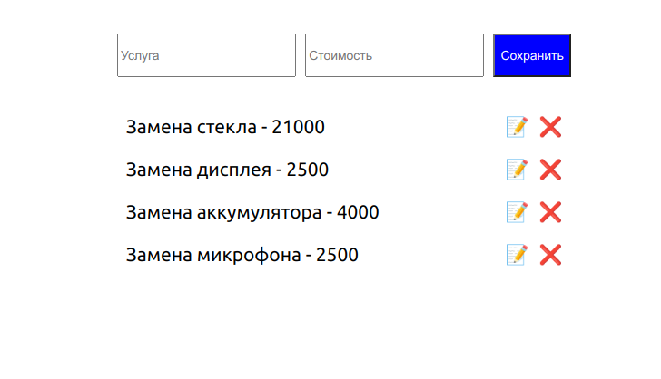
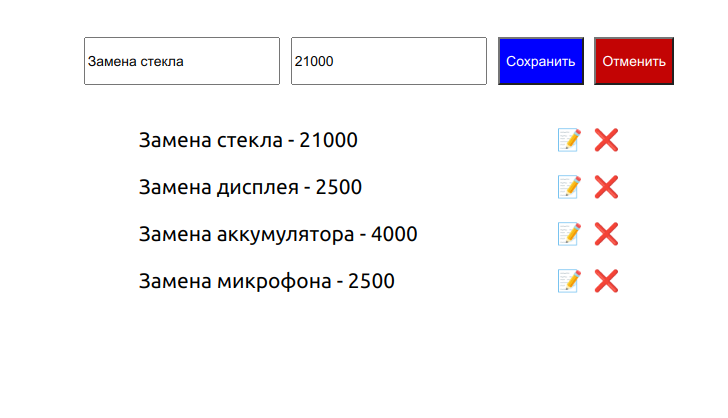
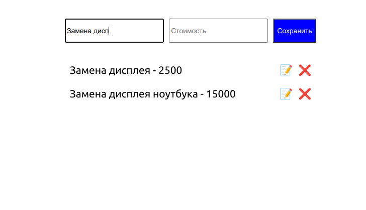

Редактирование
===

Этот проект не предполагает взаимодействия по протоколу HTTP и наличия серверной части.

1. По умолчанию показывается форма добавления, при заполнении и нажатии на кнопку Save происходит добавление элемента в список:

2. При нажатии на кнопку «Редактировать» форма автоматически заполняется данными элемента:

Далее возможны два сценария:

2.1 Если пользователь нажал на кнопку Save, запись в таблице обновляется.

2.2 Если пользователь нажал на кнопку Cancel, то поля вычищаются и снова отображается форма добавления.

3. При ввобде новой услуги список услуг фильтруется:

3.1 При пустом значении фильтра должны показываться все объекты.
3.2  Неважно, заполнен фильтр или нет, все функции редактирования — добавление, обновление, удаление — должны быть доступны.
